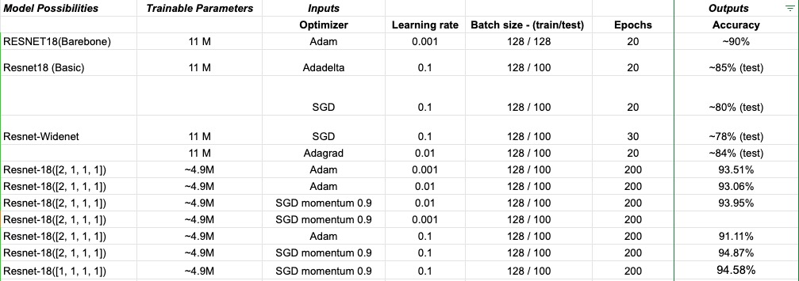

# Optimised ResNet Model
This Repository contains the experiments and implementation of optimized model of ResNet18 Architecture trained , validated and tested on the CIFAR-10 image classification datase.

## Abstract
In the work shown in this report, we try to maximize the test accuracy of the ResNet18 model by keeping a constraint where the number of trainable parameters of the new ResNet18 architecture should not exceed 5 million. We experiment on the ResNet18 model by modifying its layer structure and subjecting it to various parameters and optimizers. Finally, inferring from the experimental results, we propose  modified architectures of ResNet18, which exhibits the highest test accuracy,  given the parameter constraint. The dataset which was used was the CIFAR-10 image classification datase.
## Best Models
After trying out a various methodologies and combinations of optimizers, parameters, layer structures, it was found that 3 of the model configurations exhibited high test accuracy.
- Architecture 1: With Conv layers [2,1,1,1] block configuration for 64, 128, 256 & 512 channels respectively.
- Architecture 2: With 512 channel block removed with only [3,3,3] block configuration for 64, 128, 256 channels respectively, plus dropout for Convultional layers and extra hidden linear layer of 128 neurons.

### Metrics
| Architecture | N | Bi | Dropout | Acc(%) |
| :---:         |     :---:      |          :---: |    :---:      |     :---:     |
| 1  |  4     |   [2,1,1,1]    | -   |  94.17%   |
| 2  |  3     | [3,3,3]      | 0.2 (Conv layers + hidden layer)  |  94.33%    | 

Table 1: Architecture configurations of Best Models. N : Residual Layer, Bi: Residual Blocks, Dr : Dropout Rate Acc : Test Accuracy

### Experimentation
A snapshot of experiments carried out. Detailed information can be found below:

Please find the below link for the experimentations done during this project.

https://docs.google.com/spreadsheets/d/1zcKqYuy7a7Tt2M-SUv6CsE0WjOp50pxkuD4_kTcdCd0/edit#gid=0

# Respository Details
The BestArchitecture folder contains the model code used to setup and train the architecture along with the necessary plots. Each Model folder contains the following details
- Python Notebook having the results and plots for each model configuration
- main.py file , which has to used to execute the model
- resnetModel.py file, which defines the base architecture of the modified ResNet model
- PlotConfusionMatrix.py file for the plotting the confusion matrix , Train vs Validation plots
- Confusion_Matrix folder for storing the necessary variable created during the straining and using it for plotting graphs
- checkpoint folder stored the best model obtained during the traininf
- plots contains the plot generated for the model specified
### Code References: 
https://github.com/kuangliu/pytorch-cifar
